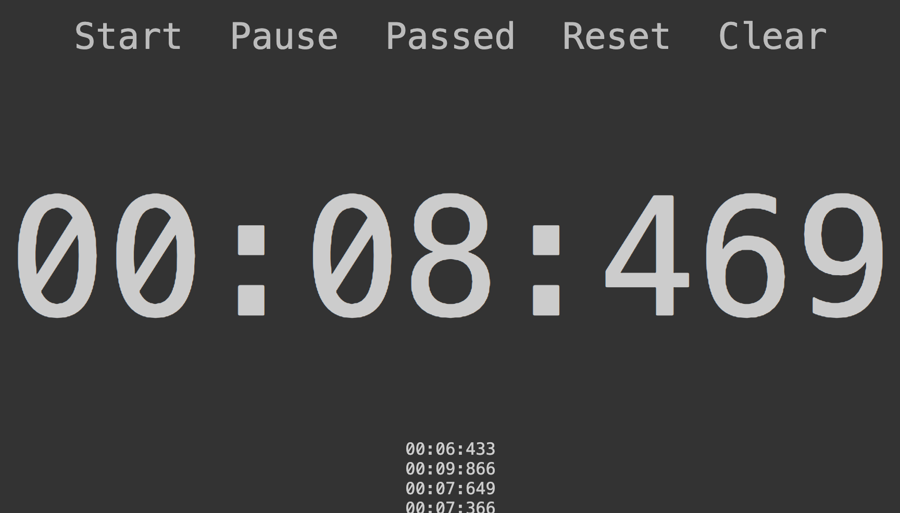

# deepracer-timer

[](https://github.com/nalbam/deepracer-timer/actions)
[](https://github.com/nalbam/deepracer-timer/releases)

* SEE: https://nalbam.github.io/2019/11/07/deepracer-timer-en.html

## usage

```bash
./run.sh init
./run.sh start
./run.sh restart
./run.sh status
./run.sh stop
```

## browser

* http://localhost:3000/timer
* http://localhost:3000/timer/limit/3

## screen



## keymap

| Action  | Key | Description |
| ------- | --- | ----------- |
| Start   |  Q  | Start the timer. |
| Pause   |  W  | Pause the timer. |
| Passed  |  E  | Record the lap time. |
| Reset   |  R  | Reset the timer to 0. |
| Clear   |  T  | Clear the timer and all lap times. |
| Drop    |  D  | Cancel the last lap time. |
| Reject  |  F  | Cancel the last lap time and merge it into the timer. |
