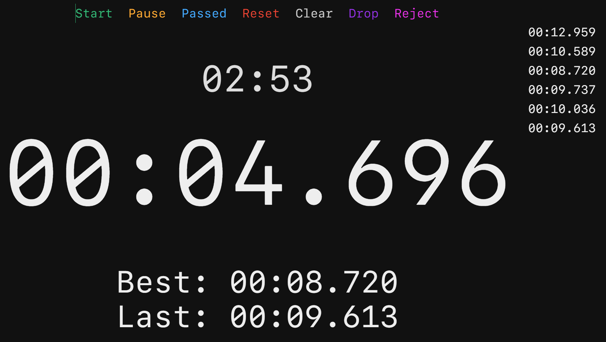

# deepracer-timer

## npm install

```bash
npm install ejs express request rpi-gpio socket.io
```

## start

```bash
./run.sh
```

## screen



## keymap

| Action | Key |
| ------ | --- |
| Start  |  Q  |
| Pause  |  W  |
| Passed |  E  |
| Reset  |  R  |
| Clear  |  T  |
